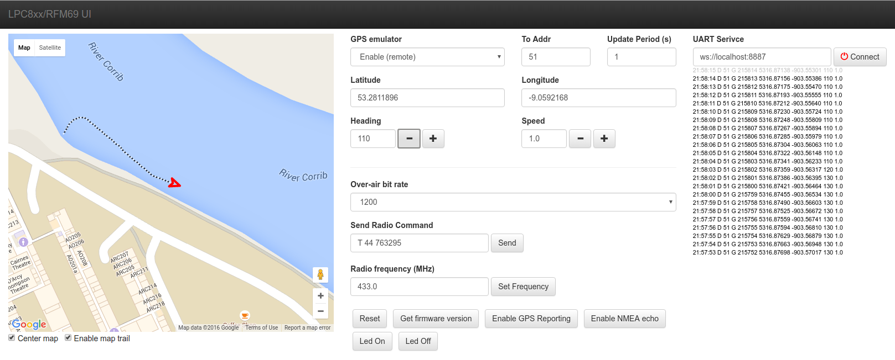

# LPC812/RFM69HW/RFM9x radio modem firmware

This is firmware to drive my LPC812/RFM69HW and LPC812/RFM9x radio modem.

The LPC812 with this firmware acts as a radio operating system, providing a simplified
interface between the RFMxx module and the host application. 

Built with LPCxpresso v7.3.0 (free IDE from NXP). 

PCB project is here: https://github.com/jdesbonnet/RFMxx_LPC812_PCB

Documentation on the UART protocol is
here:
https://docs.google.com/document/d/1FBZINVb_g0gnWlEkQYNBEHTwiyHNY0fn5J37EqBPyog/edit?usp=sharing

Also included is a web test user interface. This interfaces to modem board using
WebSockets and a UART to WebSockets bridge. See https://github.com/jdesbonnet/WebSocketUARTBridge. 

Joe Desbonnet, jdesbonnet@gmail.com
12 Oct 2016

# Release History:

## 0.7.4, 7 Aug 2017
 * Ignore UART commands starting with the comment character (';')

## 0.7.3, 27 Feb 2017
 * Change poll_interval time unit from seconds to 10 seconds to facilitate sleep interals up to 2550 seconds. 

## 0.7.2, 27 Feb 2017
 * Workaround for Issue #13: first iteration of low power mode does not go into proper
   low power mode (consumes >1mA). Solution is to make first iteration very short. Root
   cause still unknown.

## 0.7.1
 * RFM68 board sleep current now down to 2.6µA due to conditioning of MCU to RFM reset pin.

## 0.7.0, 26 Nov 2016
 * Support for RFM98 and RFM69
 * 3µA sleep current achieved with RFM98
 * 40µA sleep current achieved with RFM69
 * Print CRC status with FRAME debug message

## 0.6.1, 11 Sep 2016
 * Low battery modes (low and minimum).
 * Fixes to OTA firmware code.

## 0.6.0, 5 Sep 2016
 * Over-the-air firmware upgrade capability

## 0.5.6, 28 Aug 2016
 * Much improved algorithm for detecting for replys after transmitting a packet. Listen period (and consequently power consuption) has been
greatly reduced.
 * Parameter mode to enable/disable DS19B20 temperature sampling.
 * New remote firmware version query
 * New remote MCU ID query

## 0.5.5, 27 Aug 2016
 * Fix parameter block save when code compiled with optimization. 

## 0.5.4, 20 Aug 2016

 * Better RSSI measurement of received packet (measured before transferring frame to MCU)
 * Implement ACK mechanism (MSB of packet type is a ACK request field).
 * MCU memory read working
 * Minor fixes.

## 0.5.3, 22 Mar 2015

 * DS18B20 temperature sensor optional feature on PIO0_14.

## 0.5.2, 9 Mar 2015

 * Fix bug where S lat and W longitude were not being reported as negative.
 * RFM69 register write command can now take multiple value params. Each param written to successive register location. 
 This facilitates issuing remote commands to change parameters that span more than one byte (eg radio bps)
 
## 0.5.1, 6 Mar 2015
 * Add 'E' commend to en/disable echo of NMEA from GPS UART port to main UART port.
 * Add GPS fix type and HDOP to 'g' message
 
## 0.5.0, 1 Mar 2015
 * Support GPS module on second LPC812 UART (USART1). GPS UART TXD to pin 8 (PIO0_11). Reads NMEA 
 sentences from the GPS and echos to the main API UART (USART0).
 
## 0.4.1, 13 Feb 2015
 * Fix MCU unique ID retrieval bug
 * Use MCU unique ID to implement a hack to fix one faulty PCB board (will be removed later at some point)
 * Use MCU unique ID to assign node addresses from hard-coded table (can be over ridden with N command)
  
## 0.4.0, 11 Feb 2015
 * Supports saving settings in flash memory
 * Start to remove LPC810 legacy.
 * Display config at boot time
 * Display self-test status at boot time
 
## 0.4.1, 12 Feb 2015
 * WDT timer set command working
 * MCU Unique ID working properly
 * Read MCU unique ID to auto implement V1B PCB hack

# Programming field units

Units can be programmed through SWD or UART. 

## UART programming

Connect to UART with terminal emulator on programming header at 115200 bps. Hit RETURN a few times 
to wake and enter 'O' command to enter bootloader mode. Then disconnect terminal emulator and use
./scripts/flash.sh script to upload new firmware.

